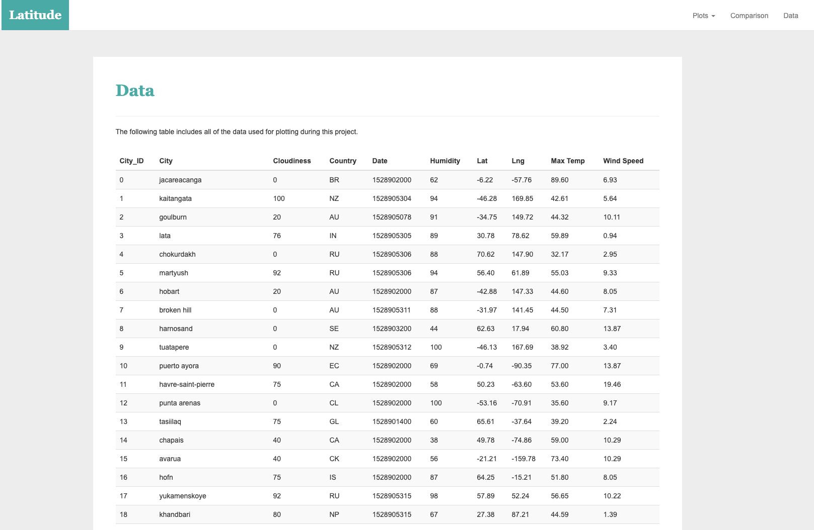

# Web Design Web Visualization Dashboard (Latitude)

## Background

### Website Requirements

The website consists of 7 pages total, including:

* A [landing page](#landing-page) containing:
  * An explanation of the project.
  * Links to each visualizations page. There should be a sidebar containing preview images of each plot, and clicking an image should take the user to that visualization.
* Four [visualization pages](#visualization-pages), each with:
  * A descriptive title and heading tag.
  * The plot/visualization itself for the selected comparison.
  * A paragraph describing the plot and its significance.
* A ["Comparisons" page](#comparisons-page) that:
  * Contains all of the visualizations on the same page so we can easily visually compare them.
  * Uses a Bootstrap grid for the visualizations.
    * The grid must be two visualizations across on screens medium and larger, and 1 across on extra-small and small screens.
* A ["Data" page](#data-page) that:
  * Displays a responsive table containing the data used in the visualizations.
    * The table must be a bootstrap table component. [Hint](https://getbootstrap.com/docs/4.3/content/tables/#responsive-tables)
    * The data must come from exporting the `.csv` file as HTML, or converting it to HTML. Try using a tool you already know, pandas. Pandas has a nifty method approprately called `to_html` that allows you to generate a HTML table from a pandas dataframe. See the documentation [here](https://pandas.pydata.org/pandas-docs/version/0.17.0/generated/pandas.DataFrame.to_html.html)

### Screenshots

#### Landing page

Large screen:

Small screen:



#### Comparisons page

Large screen:

Small screen:

#### Data page

Large screen:

Small screen:

#### Visualization pages

You'll build four of these, one for each visualization. Here's an example of one:

Large screen:

Small screen:

#### Navigation menu

Large screen:

Small screen:

